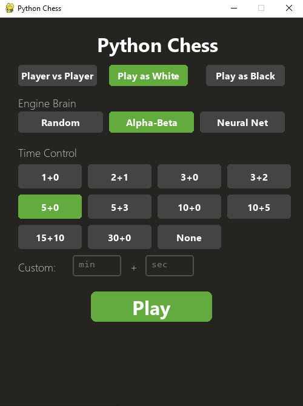
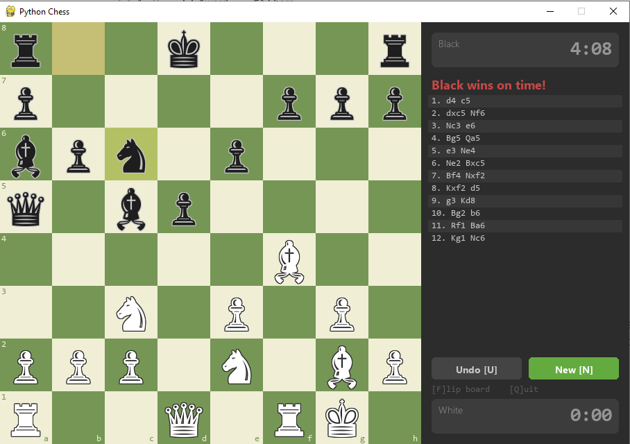

# Chess Project

A chess engine and interactive game written from scratch in Python.
No third-party chess libraries -- every component from move generation and
validation through to search, evaluation and rendering is hand-coded.

The project started as a pure-Python engine with Perft-verified move
generation and has since been extended with alpha-beta search, a
neural-network evaluator, a REST API, and a UCI interface.

<p align="center">
  
  &nbsp;&nbsp;
  
</p>
<p align="center">
  <em>Start screen with engine and time control selection (left).
  Gameplay with clocks, move log and Lichess-style board (right).</em>
</p>

---

## Table of Contents

1. [Features](#features)
2. [Project Structure](#project-structure)
3. [Requirements](#requirements)
4. [Installation](#installation)
5. [Playing the Game](#playing-the-game)
6. [Engine Brains](#engine-brains)
7. [Engine Architecture](#engine-architecture)
8. [Neural Network Evaluator](#neural-network-evaluator)
9. [UCI Protocol](#uci-protocol)
10. [REST API (optional)](#rest-api-optional)
11. [Testing](#testing)
12. [External Chess GUIs](#external-chess-guis)
13. [Future Plans](#future-plans)

---

## Features

- Complete chess rules: castling, en passant, promotion, 50-move rule,
  threefold repetition, insufficient material, stalemate and checkmate.
- Perft-tested move generation (no known bugs).
- Alpha-beta search with iterative deepening, quiescence search,
  null-move pruning, late move reductions and futility pruning.
- Repetition detection inside the search tree -- the engine will not
  repeat positions from the current game.
- Zobrist-keyed transposition table.
- MVV-LVA move ordering with killer moves and history heuristic.
- PeSTO-tuned tapered evaluation with separate middlegame and endgame
  piece-square tables, bishop pair bonus and tempo.
- Optional PyTorch neural-network evaluator (NNUE-style, 768-input).
- Pygame GUI with Lichess-style board, clocks, time presets, and an
  engine brain selector on the start screen.
- Engine search runs in a background thread so the GUI stays responsive
  while the bot is thinking.
- Terminal CLI for headless play.
- UCI interface for use with external chess GUIs.
- FastAPI + MongoDB REST API for networked/stateless games (optional,
  not needed for local play).
- FEN, PGN and SAN support.

---

## Project Structure

```
chess_project/
  src/chess_project/
    core/
      types.py          Colour, piece, move and square definitions.
                        Protocol interfaces: SearchService, Evaluator,
                        MoveOrderer.
      attacks.py        Pre-computed attack tables (knight, king, pawn)
                        and sliding-piece ray directions.
      position.py       Mutable board state (1D 64-element list).
                        Legal and pseudo-legal move generation,
                        make/unmake.
      rules.py          Game session wrapper. Tracks move history,
                        enforces draw rules, detects checkmate and
                        stalemate.

    engine/
      interfaces.py     RandomMover baseline (satisfies SearchService).
      evaluator.py      PeSTO-tuned tapered evaluation with separate
                        middlegame and endgame piece-square tables,
                        bishop pair bonus and tempo.
      ordering.py       MvvLvaOrderer: MVV-LVA capture scoring,
                        killer moves and history heuristic. Used by
                        AlphaBetaSearch.
      search.py         AlphaBetaSearch: modular search that accepts
                        pluggable Evaluator and MoveOrderer instances.
                        Zobrist hashing, TranspositionTable, and
                        repetition detection.
      ml_evaluator.py   PyTorch neural-network evaluator. Includes
                        the network definition, training loop and a
                        CLI for data download / generation / training.

    io/
      fen.py            FEN parser and formatter.
      pgn.py            PGN import and export.
      notation.py       UCI and SAN move parsing / formatting.
      uci.py            UCI protocol loop for external GUIs.

    api/
      main.py           FastAPI application. Endpoints for creating
                        games, submitting moves and querying state.
                        Loads the engine via lifespan events.
                        Only needed if you want to run the engine as
                        a web service.

    db/
      models.py         MongoDB document model (Beanie ODM) for
                        persisted games. Only used by the API.

    ui/
      gui.py            Pygame GUI with start screen, engine brain
                        selector, board rendering, clocks, move log
                        and promotion chooser.
      cli.py            Terminal REPL for playing via stdin/stdout.

  tests/
    test_perft.py       Move generation correctness (Perft suite).
    test_position.py    Board state and make/unmake tests.
    test_fen.py         FEN round-trip tests.
    test_types.py       Type and helper function tests.

  engine.bat            Windows batch file to launch the UCI engine.
  model.pt              Trained neural-network weights (generated).
  train_data.bin        Training data (generated, not committed).
  pyproject.toml        Build configuration (setuptools).
```

---

## Requirements

- Python 3.11 or later.
- pygame (required for the GUI).
- PyTorch (optional, only needed for the neural-network evaluator).
- datasets (optional, only needed for downloading Lichess training data).
- FastAPI, uvicorn, Motor, Beanie (optional, only needed for the REST
  API -- not required for local play).
- MongoDB (optional, only needed for the REST API).

---

## Installation

### 1. Create a virtual environment

```bash
python -m venv .venv

# Windows
.venv\Scripts\activate

# macOS / Linux
source .venv/bin/activate
```

### 2. Install the core package

```bash
pip install -e .
```

This installs `chess_project` in editable mode along with its only hard
dependency, pygame.

### 3. Install optional dependencies

```bash
# For the neural-network evaluator and training pipeline
pip install torch datasets

# For the REST API (you do not need this for local play)
pip install fastapi uvicorn motor beanie
```

On systems with an NVIDIA GPU, install the CUDA variant of PyTorch for
hardware-accelerated training:

```bash
pip install torch --index-url https://download.pytorch.org/whl/cu124
```

---

## Playing the Game

### Pygame GUI (recommended)

```bash
python -m chess_project.ui.gui
```

A start screen lets you choose:

- **Player vs Player** -- two humans on one machine.
- **Play as White** -- you play white, the engine plays black.
- **Play as Black** -- you play black, the engine plays white.

Below the mode selector there is an **Engine Brain** selector (see the
next section for what each option does). Then pick a time control or set
a custom one, and press Play.

The engine thinks in a background thread so the board stays responsive
while it is calculating. A "Thinking..." message appears in the side
panel.

Keyboard shortcuts during play:

| Key | Action          |
|-----|-----------------|
| U   | Undo last move  |
| N   | New game        |
| F   | Flip the board  |
| Q   | Quit            |

### Terminal CLI

```bash
python -m chess_project.ui.cli
```

Moves are entered in UCI notation (e.g. `e2e4`, `g1f3`, `e7e8q`).
Type `moves` to list all legal moves, `undo` to take back, or `quit`
to exit.

---

## Engine Brains

The start screen lets you pick which engine plays against you.  All
options use the same Perft-verified move generator -- they only differ
in how they decide which move to play.

| Button        | Engine class       | What it does                                                                                          |
|---------------|--------------------|-------------------------------------------------------------------------------------------------------|
| **Random**    | `RandomMover`      | Picks a legal move at random. Useful for testing or if you want an easy opponent.                      |
| **Alpha-Beta**| `AlphaBetaSearch`  | Alpha-beta search with Zobrist hashing, transposition table, repetition detection, null-move pruning, LMR, futility pruning and PeSTO-tuned evaluation. Accepts pluggable evaluator/orderer components. |
| **Neural Net**| `AlphaBetaSearch` + `NNEvaluator` | Same search as Alpha-Beta, but positions are scored by a trained PyTorch neural network instead of the hand-crafted function. Only appears if `model.pt` exists (see the Neural Network section below). |

The Alpha-Beta engine uses Zobrist hashing for fast transposition table
lookups and detects position repetitions during search, so it avoids
shuffling pieces back and forth when there is no progress to be made.
It accepts pluggable components, so you can swap in different evaluators
(e.g. the neural network) without changing the search code.

---

## Engine Architecture

The engine searches using negamax alpha-beta with the following
enhancements:

- **Iterative deepening**: searches depth 1, then depth 2, and so on.
  The best move from each iteration seeds move ordering for the next.
  Search stops when the time limit is reached and returns the best
  move found so far.

- **Transposition table**: a fixed-size hash table keyed by Zobrist
  hash. Stores the best move, score, depth and bound type (exact,
  upper or lower) for previously searched positions. Avoids redundant
  work when the same position is reached via different move orders.

- **Repetition detection**: the search tracks Zobrist hashes along the
  current path and compares against positions from the actual game.
  If a position would repeat, it is scored as a draw. This prevents
  the engine from shuffling pieces aimlessly.

- **Quiescence search**: at leaf nodes, continues searching capture
  sequences to avoid the horizon effect. Uses delta pruning to skip
  captures that cannot possibly raise alpha.

- **Null-move pruning**: if the side to move can pass and still maintain
  a beta cutoff at reduced depth, the subtree is pruned.

- **Late move reductions (LMR)**: quiet moves searched late in the move
  list are searched at reduced depth first. If they look promising, a
  full-depth re-search is performed.

- **Futility pruning**: near leaf nodes, quiet moves that cannot
  plausibly raise the score above alpha are skipped.

- **Check extensions**: positions where the side to move is in check
  are searched one ply deeper.

- **Move ordering** (MVV-LVA): captures are scored by Most Valuable
  Victim minus Least Valuable Attacker. Killer moves and the history
  heuristic order quiet moves.

The static evaluation function uses PeSTO-tuned piece-square tables with
tapered interpolation between middlegame and endgame scores based on the
remaining material (game phase). It also includes a bishop-pair bonus
and a small tempo bonus for the side to move.

---

## Neural Network Evaluator

An optional NNUE-style evaluator that replaces the hand-crafted
evaluation function.

### Architecture

```
Input (768 binary features: 12 piece types x 64 squares)
  -> Fully connected 256 neurons, clipped ReLU
  -> Fully connected 32 neurons, ReLU
  -> Fully connected 1 neuron, tanh
  -> Scaled to centipawns (+/- 800)
```

Total parameters: approximately 205,000.

### Training

Training data can come from two sources:

**Option A -- download Stockfish-labelled positions from Lichess
(recommended):**

```bash
pip install datasets
python -m chess_project.engine.ml_evaluator download --n 2000000
```

This streams positions from the
[Lichess/chess-position-evaluations](https://huggingface.co/datasets/Lichess/chess-position-evaluations)
dataset on Hugging Face. Each position has a FEN string and a Stockfish
centipawn evaluation. Downloading 2 million positions takes roughly
5 to 10 minutes.

**Option B -- generate data via self-play with the built-in engine:**

```bash
python -m chess_project.engine.ml_evaluator generate --n 2000000 --depth 4
```

This is slower (CPU-bound) and produces lower-quality labels, but works
offline.

**Train the network:**

```bash
python -m chess_project.engine.ml_evaluator train --epochs 10 --batch-size 4096
```

On an NVIDIA RTX 3080, training 10 epochs on 2 million positions takes
under a minute. The trained weights are saved to `model.pt`.

### Using the trained model

Once `model.pt` exists in the project root, the "Neural Net" button
appears automatically on the GUI start screen.

You can also use it programmatically:

```python
from chess_project.engine.ml_evaluator import NNEvaluator
from chess_project.engine.search import AlphaBetaSearch

evaluator = NNEvaluator("model.pt")
engine = AlphaBetaSearch(evaluator=evaluator)
move = engine.choose_move(position, time_ms=5000)
```

---

## UCI Protocol

The engine speaks the Universal Chess Interface protocol, which lets it
plug into any UCI-compatible chess GUI.

### Running the UCI engine

```bash
python -m chess_project.io.uci
```

To use the neural-network evaluator instead of the hand-crafted one:

```bash
python -m chess_project.io.uci --model model.pt
```

On Windows, a convenience batch file is provided:

```bash
engine.bat
```

### Supported UCI commands

| Command                        | Description                                       |
|--------------------------------|---------------------------------------------------|
| `uci`                          | Engine identifies itself and prints `uciok`.      |
| `isready`                      | Engine responds with `readyok` when initialised.  |
| `ucinewgame`                   | Resets the board and clears the transposition table. |
| `position startpos [moves ...]`| Sets the board to the starting position, optionally applying a sequence of moves. |
| `position fen <fen> [moves ...]`| Sets the board to the given FEN string.          |
| `go depth <n>`                 | Search to a fixed depth.                          |
| `go movetime <ms>`             | Search for a fixed number of milliseconds.        |
| `go wtime <ms> btime <ms>`     | Search with time management based on remaining clock time. |
| `go infinite`                  | Search until a `stop` command (not yet implemented). |
| `quit`                         | Exit the engine process.                          |

---

## REST API (optional)

This section is only relevant if you want to host the engine as a web
service. It is **not needed** for local play -- the Pygame GUI, terminal
CLI and UCI interface all work without it.

The API exists so that a web frontend (or any HTTP client) can create
games, submit moves and query board state over the network. Game state
is persisted in MongoDB so the server itself is stateless.

### Prerequisites

```bash
pip install fastapi uvicorn motor beanie
```

You also need MongoDB running locally on port 27017 (the default), or
set the `MONGO_URI` environment variable to point to your instance.
If you do not have MongoDB installed and do not plan to use the API,
you can skip this section entirely.

### Starting the server

```bash
uvicorn chess_project.api.main:app --reload
```

### Configuration (environment variables)

| Variable       | Default                        | Description                     |
|----------------|--------------------------------|---------------------------------|
| `MONGO_URI`    | `mongodb://localhost:27017`    | MongoDB connection string.      |
| `MONGO_DB`     | `chess`                        | Database name.                  |
| `MODEL_PATH`   | `model.pt`                     | Path to the neural-network weights. If the file does not exist, the hand-crafted evaluator is used. |
| `EVAL_DEVICE`  | auto                           | `cpu` or `cuda`.                |
| `SEARCH_DEPTH` | `20`                           | Maximum search depth.           |

### Endpoints

**Create a game:**

```
POST /api/v1/game
{
    "game_id": "game-001",
    "fen": null,
    "white": {"name": "Alice"},
    "black": {"name": "Engine", "is_engine": true}
}
```

**Ask the engine to play a move:**

```
POST /api/v1/game/game-001/move
{"time_ms": 5000}
```

**Submit a human move:**

```
POST /api/v1/game/game-001/play?uci=e2e4
```

**Get game state:**

```
GET /api/v1/game/game-001
```

Interactive API documentation is available at `/docs` when the server is
running.

---

## Testing

```bash
pip install pytest
pytest
```

The test suite covers:

- **Perft** (`test_perft.py`): validates move generation against known
  node counts at various depths for the starting position and several
  tricky positions (castling, en passant, promotions, pins).
- **Position** (`test_position.py`): make/unmake round-trips, king
  tracking, castling-rights updates.
- **FEN** (`test_fen.py`): parsing and formatting round-trips.
- **Types** (`test_types.py`): piece encoding, square helpers, move
  serialisation.

---

## External Chess GUIs

The UCI interface allows you to use this engine with third-party chess
GUIs. Two popular options:

### CuteChess (Windows, macOS, Linux)

An open-source chess GUI that supports UCI engines. Cross-platform.

- Repository: [github.com/cutechess/cutechess](https://github.com/cutechess/cutechess)
- Download: [github.com/cutechess/cutechess/releases](https://github.com/cutechess/cutechess/releases)

To add this engine in CuteChess: go to Tools > Settings > Engines >
Add, then set the command to the full path of `engine.bat` (Windows) or
`python -m chess_project.io.uci` with the working directory set to the
project root.

### Arena (Windows only)

A free chess GUI with UCI and WinBoard support.

- Website: [playwitharena.de](http://www.playwitharena.de/)

To add this engine in Arena: go to Engines > Install New Engine, browse
to `engine.bat` and confirm.

---

## Future Plans

Things on the roadmap, roughly in order of priority:

- **Online multiplayer.** WebSocket-based matchmaking so two players can
  play each other over the network in real time. The REST API already
  handles game state -- the main work is adding a lobby, pairing, and
  live move streaming.

- **Web frontend.** A browser-based board UI (likely React or plain JS)
  that talks to the API. Would replace the need for a local Pygame
  install and make the engine accessible to anyone with a browser.

- **Stronger NNUE.** The current network is a 768 → 256 → 32 → 1
  architecture trained on 2 million Stockfish-labelled positions. There
  is plenty of room to improve: larger training sets, deeper networks,
  incremental update (true NNUE-style accumulator), and better data
  filtering.

- **Retrain with self-play reinforcement.** Use the engine's own games
  at higher depths as training signal, iterating between playing and
  retraining to bootstrap quality without relying on external labels.

- **Opening book.** Load a polyglot or custom opening book so the engine
  plays sensible theory in the first few moves instead of searching from
  scratch every time.

- **Endgame tablebases.** Syzygy tablebase probing for perfect play in
  positions with 6 or fewer pieces.

- **Search improvements.** Aspiration windows, principal variation
  search (PVS), singular extensions, and multi-threaded (Lazy SMP)
  search to use all available cores.

---

## Licence

MIT. See [LICENSE](LICENSE) for details.
